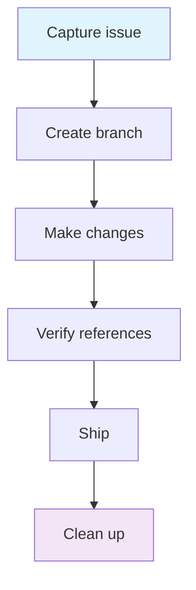

# I need to update documentation

## When to use

You need to add, update, or fix documentation — READMEs, specs, architecture docs, or reference material. No code changes involved.

## Prerequisites

- On `main` with latest changes
- Know what documentation needs changing

## Diagram

## Flow

### Step 1: Capture the issue
Ensure a GitHub issue exists if the change is non-trivial. Trivial fixes (typos, broken links) can skip this.
→ `/start` (creates issue if needed)

**Adapts when:**
- Trivial fix (typo, formatting) → skip issue creation, proceed directly
- Significant doc change → create issue to track the work

### Step 2: Create a branch
→ `git checkout -b docs/<description>`

### Step 3: Make changes
Edit the documentation files directly.

**Adapts when:**
- Changing a spec's HUMAN sections (Purpose, Behaviour) → on next `/consolidate` or `/health-check`, status will reflect any drift (`active` if reconciled, `stale` if drift detected)
- Adding a new governed doc → copy from `docs/templates/spec.md` for specs, or `docs/templates/` for other document types
- Updating CLAUDE.md → changes affect AI behaviour, review carefully
- Updating public-facing docs (README.public.md, CLAUDE.public.md) → remember these sync to the public repo

### Step 4: Verify references
Check that cross-references between documents are still valid.
→ `/health-check` (catches broken references, missing files, ownership issues)

**Adapts when:**
- Layer 0 project → skip validation if no register or contracts exist yet
- Layer 1+ project → `/health-check` for a full governance check

### Step 5: Ship
→ `/pr` (create pull request — `/finish` is for code changes with spec promotion)

**Adapts when:**
- Changes touch agent-facing files (CLAUDE.md, skills, hooks) → `/security-review` before PR
- Changes touch the public README → verify rendering on GitHub

### Step 6: Clean up
→ `/cleanup` (after PR merges)

## Done when

- Documentation is accurate and up to date
- Cross-references are valid
- PR merged

## Hands off to

- [Feature workflow](feature.md) — if doc changes reveal a missing feature
- [Bug fix workflow](bug-fix.md) — if doc review reveals incorrect behaviour
