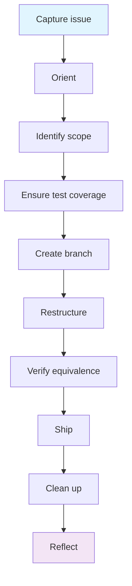

# I need to restructure without changing behaviour

## When to use

Code works but is hard to understand, maintain, or extend. You want to improve structure, naming, or organisation without changing what the code does.

## Prerequisites

- On `main` with latest changes
- Existing tests pass (you need a baseline to prove equivalence)
- Clear idea of what's wrong with the current structure

## Diagram

## Flow

### Step 1: Capture the issue
Ensure a GitHub issue exists describing what needs restructuring and why.
→ `/start` (creates issue if needed, routes to this workflow)

### Step 2: Orient
Understand which specs own the code being refactored.
→ Review `REGISTER.md` to identify which specs own the code being refactored

### Step 3: Identify scope
Define exactly what's changing and what's not. A refactor that changes interfaces is larger than one that changes internals.

**Adapts when:**
- Internal refactor (same interfaces) → no spec update needed, permitted without spec change
- Interface refactor (signatures, APIs change) → specs must be updated first
- Cross-spec refactor (moving code between specs) → update ownership in register

### Step 4: Ensure test coverage
Before changing anything, confirm tests exist that will catch regressions.
→ `superpowers:test-driven-development` (write tests for untested paths if needed)

**Adapts when:**
- Good test coverage exists → proceed directly
- No tests exist → write characterisation tests first (tests that capture current behaviour)

### Step 5: Create a branch
→ `git checkout -b chore/<refactor-description>`

### Step 6: Restructure
Make the structural changes in small, verifiable steps. Run tests after each step.
→ `superpowers:test-driven-development` (refactor step — keep tests green throughout)

**Adapts when:**
- Simple rename/move → do it in one step
- Complex restructure → break into smaller commits, each preserving tests

### Step 7: Verify equivalence
Confirm behaviour is unchanged.
→ `superpowers:verification-before-completion` (all tests pass, no regressions)
→ `superpowers:requesting-code-review` (review the structural changes)

### Step 8: Ship
→ `/finish` (runs health check, creates PR)

**Adapts when:**
- Ownership changed → `/finish` flags register updates needed
- Layer 2 project → contract tests verify definition conformance

### Step 9: Clean up
→ `/cleanup` (after PR merges)
→ `/reflect` (optional — what made this refactor necessary? how to prevent structural debt?)

## Done when

- All tests pass (same tests as before, proving equivalence)
- Code is cleaner, better organised, or easier to extend
- No behaviour changes
- PR merged

## Hands off to

- [Feature workflow](feature.md) — the refactor often unblocks a feature that motivated it
- [Documentation workflow](documentation.md) — if the restructure changes how things are described
