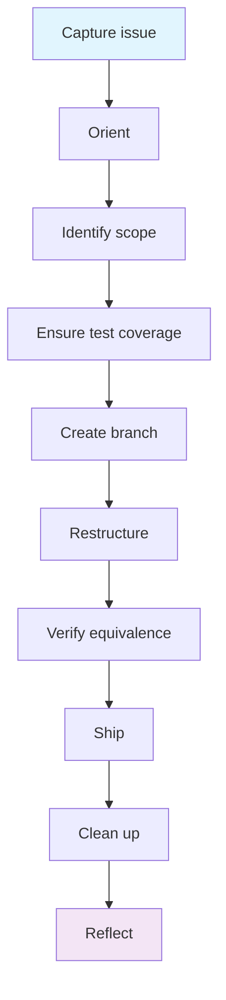

# I need to restructure without changing behaviour

## When to use

Code works but is hard to understand, maintain, or extend. You want to improve structure, naming, or organisation without changing what the code does.

## Prerequisites

- On `main` with latest changes
- Existing tests pass (you need a baseline to prove equivalence)
- Clear idea of what's wrong with the current structure

## Path selection — A or B?

Refactors are almost always **Path A** — the existing spec describes the behaviour to preserve, and the refactor changes implementation without changing behaviour. The governed spec already exists at `active`; the refactor doesn't change it (or changes only Implementation Notes).

**Path B applies only** when the refactor surfaces a *new architectural concern* worth a design conversation (e.g., "splitting this module is the right move, but the new boundaries need brainstorming"). In that case, switch to a feature-style flow with a design spec.

## Diagram

## Flow

## Artifact Flow

| Step | Reads | Produces | Location | Authority |
|---|---|---|---|---|
| 1. Capture issue (`/start`) | symptom, code | GitHub issue | GitHub | — |
| 2. Orient | `REGISTER.md`, governed specs | which specs own affected code | (notes) | — |
| 3. Identify scope | code | scope decision: internal / interface / cross-spec | (notes) | — |
| 4. Test coverage | code, tests | characterization tests if missing (Path A → safety net) | `tests/` | source |
| 5. Branch | git | `chore/<refactor>` branch | git | — |
| 6. Restructure | code, tests | restructured code (tests still green) | source dirs | source |
| 7. Verify | tests, code review | green-tests confirmation, review notes | (review notes) | — |
| 8. `/finish` | code + tests + spec | reconciled spec via `/consolidate`; PR | `docs/specs/` | owning |
| 9. `/cleanup` + `/reflect` | branch state, session memory | clean main; lessons | git, memory | — |

### Step 1: Capture the issue
Ensure a GitHub issue exists describing what needs restructuring and why.
→ `/start` (creates issue if needed, routes to this workflow)

### Step 2: Orient
Understand which specs own the code being refactored.
→ Review `REGISTER.md` to identify which specs own the code being refactored

### Step 3: Identify scope
Define exactly what's changing and what's not. A refactor that changes interfaces is larger than one that changes internals.

**Adapts when:**
- Internal refactor (same interfaces) → no spec update needed, permitted without spec change
- Interface refactor (signatures, APIs change) → specs must be updated first
- Cross-spec refactor (moving code between specs) → update ownership in register

### Step 4: Ensure test coverage
Before changing anything, confirm tests exist that will catch regressions.
→ `superpowers:test-driven-development` (write tests for untested paths if needed)

**Adapts when:**
- Good test coverage exists → proceed directly
- No tests exist → write characterisation tests first (tests that capture current behaviour)

#### Wrapped delegation — workflow-level TDD wrap

This workflow invokes `superpowers:test-driven-development` at three points (Step 4 to write characterization tests, Step 6 to keep them green during the refactor, and verification at Step 7). Apply the workflow-level wrap (see `docs/ARCHITECTURE.md ## Wrapped delegation pattern` and the canonical example in `workflows/feature.md` § Build), but adapted for refactor's "preserve, don't change" mode:

- **Brief** — the test taxonomy from `CLAUDE.md ## Testing`; the cycle is *characterization first, refactor cycle is keep-green throughout* (not red → green → refactor); tests must capture *current* behaviour, not aspirational behaviour.
- **Capture user contributions** — ask: "Where is the existing behaviour fragile or under-documented? Are there interactions you've debugged before that should have characterization tests before we touch this code?" Each item becomes a characterization test before Step 5's branch.
- **Verify post-restructure** — same tests pass with same assertions (no test was loosened to accommodate the new structure); no test was added that asserts new behaviour; user-contributed fragile-area tests still hold.

The "no test was loosened" check is the load-bearing one for refactors — without it, "tests pass" can mean "tests were edited to pass," which silently changes behaviour while *appearing* equivalent.

### Step 5: Create a branch
→ `git checkout -b chore/<refactor-description>`

### Step 6: Restructure
Make the structural changes in small, verifiable steps. Run tests after each step.
→ `superpowers:test-driven-development` (refactor step — keep tests green throughout)

**Adapts when:**
- Simple rename/move → do it in one step
- Complex restructure → break into smaller commits, each preserving tests

### Step 7: Verify equivalence
Confirm behaviour is unchanged.
→ `superpowers:verification-before-completion` (all tests pass, no regressions)
→ `superpowers:requesting-code-review` (review the structural changes)

### Step 8: Ship
→ `/finish` (runs health check, creates PR)

**Adapts when:**
- Ownership changed → `/finish` flags register updates needed
- Layer 2 project → contract tests verify definition conformance

### Step 9: Clean up
→ `/cleanup` (after PR merges)
→ `/reflect` (optional — what made this refactor necessary? how to prevent structural debt?)

## Done when

- All tests pass (same tests as before, proving equivalence)
- Code is cleaner, better organised, or easier to extend
- No behaviour changes
- PR merged

## Hands off to

- [Feature workflow](feature.md) — the refactor often unblocks a feature that motivated it
- [Documentation workflow](documentation.md) — if the restructure changes how things are described

## Transitions

- **→ bug-fix:** If restructuring surfaces a bug, pause the refactor, capture the bug as a separate issue. Fix inline if trivial, or start a bug-fix branch.
