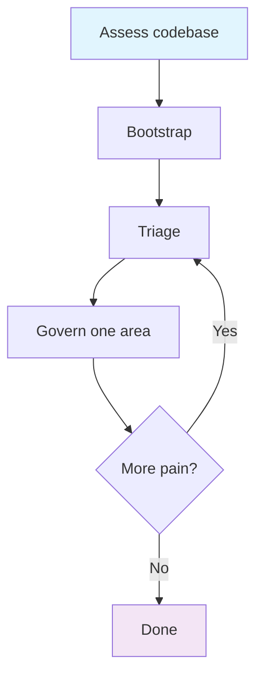

# Workflow: Retrofit

Progressively add arboretum governance to an existing codebase. You don't have to govern everything at once — start with one spec and grow.

## When to use

You have an existing codebase and want to add arboretum governance. The project already has code, but no specs, no register, and no structured ownership.

## Prerequisites

- An existing codebase with a git repository
- Claude Code installed

## Diagram

## Flow

### Step 1: Assess

Read the codebase. Understand its structure, count files and modules, identify major boundaries.

**What to look at:**
- Directory structure — where are the natural boundaries?
- File count and distribution — how big is the surface area?
- Change history — which areas change most often?
- Pain points — what breaks, what's hard to change, what's confusing?

**Output:** A mental model of the codebase's shape and its highest-pain areas.

### Step 2: Bootstrap

→ `/init-project` in the existing project directory

This creates the arboretum scaffolding (`CLAUDE.md`, `docs/`, `.claude/`) alongside the existing code. It does not modify existing files.

### Step 3: Triage

Identify the highest-pain area — the code that changes most, breaks most, or is hardest to understand. That's your first spec.

**Heuristics for picking the first area:**
- Most-changed files (use `git log --stat` to find hotspots)
- Most-buggy area (where do issues cluster?)
- Most-complex module (what's hardest to explain?)
- Shared code that multiple features depend on

**Output:** A single area selected for governance.

### Step 4: Govern one

Create a spec for the selected area:
1. Write the spec (Purpose + Behaviour) in `docs/specs/`
2. Add `# owner: <spec-name>` comments to the files it owns
3. Run `/health-check` to verify ownership is clean

**Adapts when:**
- Area is small (1-3 files) → single spec, straightforward
- Area is large (10+ files) → consider splitting into 2-3 cohesive specs

### Step 5: Expand (repeat as needed)

Return to step 3 and pick the next highest-pain area. Repeat until governance covers the areas that matter.

**Key principle:** You don't need 100% coverage. Govern the code that changes, the code that breaks, and the code that's shared. Leave stable, simple, rarely-touched code ungoverned — it's not worth the overhead.

## Done when

- The highest-pain areas have specs and ownership
- `/health-check` runs clean for governed areas
- You have enough governance that changes feel predictable

## Hands off to

- [Feature workflow](feature.md) — to add new behaviour to the governed codebase
- [Bug-fix workflow](bug-fix.md) — to fix bugs with spec awareness
